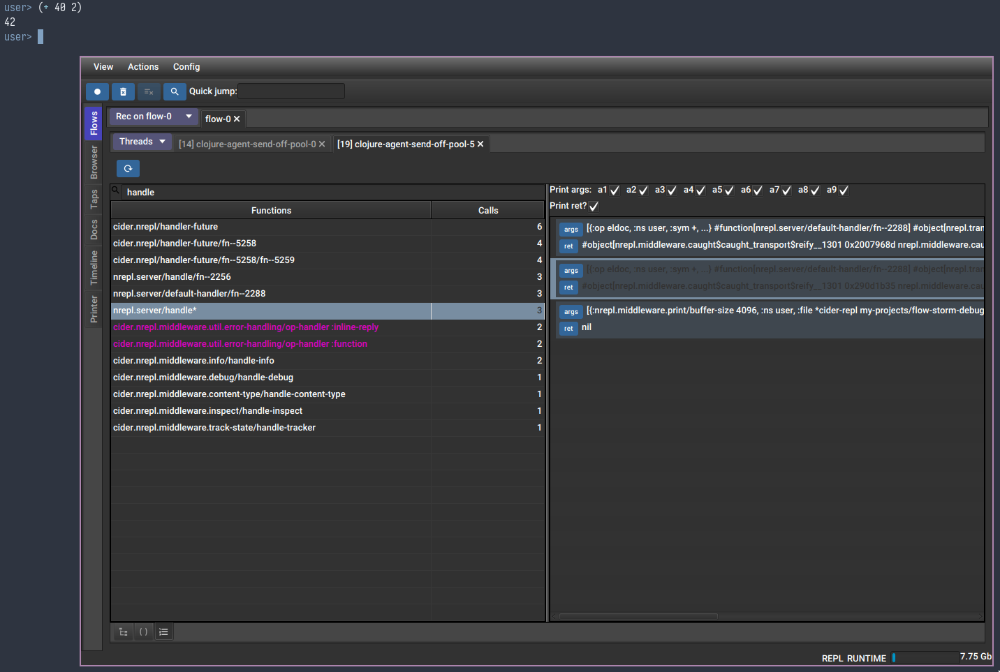

# Repo for debugging cider and nrepl with FlowStorm

## Steps

- clone this repo
- make sure the dependencies are the latest
- Run `clj -A:dev` # to start a repl with cider and nrepl instrumented
- Eval the `:dbg` keyword to start the flow-storm UI
- Pause recording in the UI (unless you want to debug nrepl server startup)
- Run `(start-server 7744)` to start a nrepl server with cider-nrepl middleware
- Connect from your editor to localhost:7744
- Repeat
  - Unpause recording
  - Clear any old recordings (Ctrl-l)
  - Run something in your editor repl so it sends messages to our nrepl server
  - Pause recording (optionally in case your editor keeps sending ping messages or something)
  - Analize your recordings (if you don't know how to use FlowStorm type `:tut/basics` at the repl)
  

